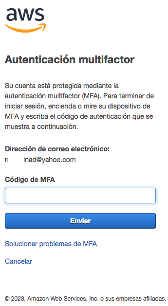

# Week 0 — Billing and Architecture

## 1. Summary of business requirements session

## 2. Spend Considerations

## 3. Security Considerations

### 3.1 MFA

As a best practice, is important to secure root account by Multi Factor Authentication. Example below:

## 4. Recreate Conceptual Diagram

## 5. Logical Architectual Diagram

## 6. Create an Admin User

## 7. Use CloudShell

## 8. Generate AWS Credentials

## 9. Installed AWS CLI

## 10. Create a Billing Alarm

## 11. Create a Budget