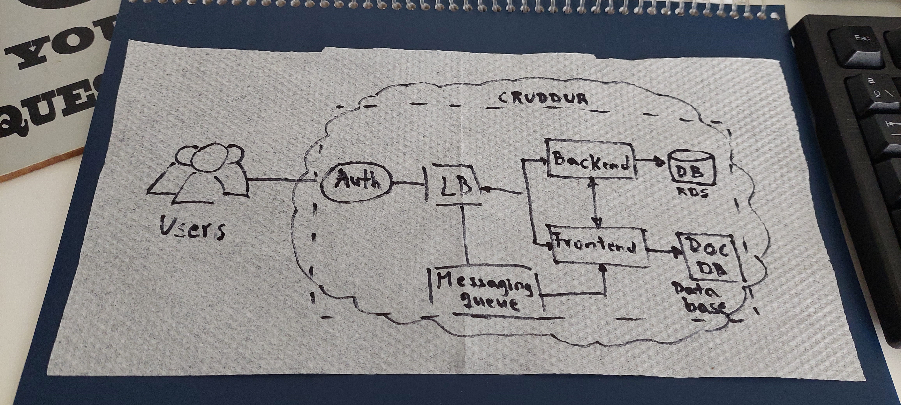

# Week 0 — Billing and Architecture

## Summary of business requirements session

I'll include a short description of the project.

## Spend Considerations

### Billing Alarm

In order to monitor your cloud expenses, if important to have at least a billing alert for total charges in a period of time. For example:

### Budgets

I set a monthly budget for a total of $10.00. It looks like this:

## Security Considerations

### MFA

As a best practice, is important to secure root account by Multi Factor Authentication. Example below:

### Organizational Structure

These are my organization units:

### IAM User

In order to avoid using your root account for everything, just create an admin user. For example:

### Security Control Policies

As Ashish showed in [Cloud Security Podcast](https://tinyurl.com/5n7xcx6y), I followed the practice for defining an SCP for prevent leaving organization as shown below:

## Recreate Conceptual Diagram

My overall understanding of the business needs were put on a napkin like this:

## Logical Architectual Diagram

[Here](https://tinyurl.com/48ekrcz3) it can be display. I recreated the architecture showed in this [tutorial](https://tinyurl.com/2p8pjafv).

## Use CloudShell

AWS provide a shell on its cloud for using the command line like this:

## Generate AWS Credentials

For IAM user created, you have to create credentials if you are going to use CLI. For instance:

## Installed AWS CLI

I used my local environment to install AWS CLI. Because of I run this on a Mac, I followed this [instructions](https://docs.aws.amazon.com/cli/latest/userguide/getting-started-install.html) for installing:

